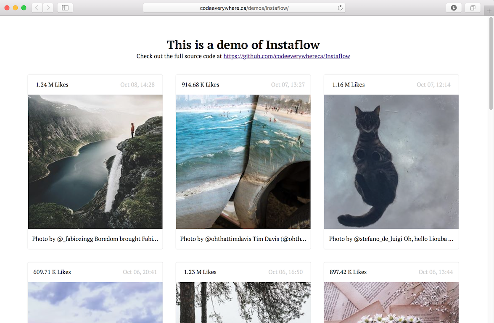

# Instaflow
Super simple way to add Instagram photos to any website



# How To Install
Download the PHP, Javascript and CSS, then include it in your HTML:
```html
<link rel="stylesheet" href="Instaflow.css" />
<script type="text/javascript" src="Instaflow.js"></script>
```
The PHP script acts as a cache so your requests dont overuse Instagrams servers.

# Usage
```php
$username = "instagram";
```

```js
Instaflow({
  target  : '.instagram',   // <div> class to insert
}).load();
```

# Demo
View a live demo here: http://codeeverywhere.ca/demos/instaflow/

# Change Log
1.1
- Moved username server-side
- Fixed Regex

1.0
- Initial release

# License
MIT
